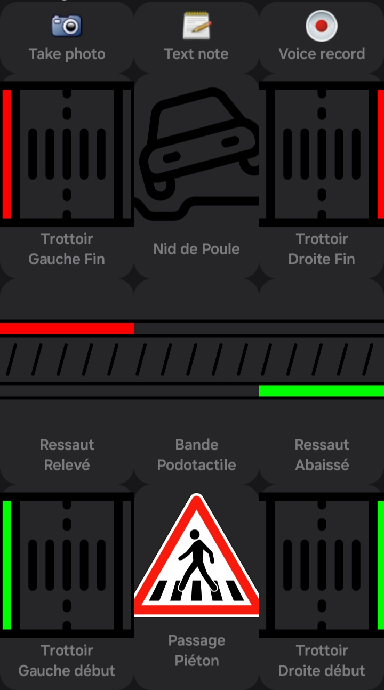

# Trottoir - Cartographie en roulant/marchant
Ce layout est fait pour cartographier les trottoirs.

Cette application ne permet que l'enregistrement hors-ligne, vous devrez choisir votre méthode lorsque vous ajouterez les informations récoltées sur vos trajets à la maison sur jOSM ou ID. C'est une contribution à OSM asynchrome en quelque sorte, ou en deux temps.
Pour une aide sur comment utiliser le fichier GPX crée, merci d'aller voir la documentation de l'application [ici](https://github.com/labexp/osmtracker-android/wiki/).

Je vous conseillerais aussi de participer au projet [Panoramax](https://panoramax.fr/) si possible. Une image peut toujours aider une fois de retour à la maison si y'a eu quelques incohérences dans l'enregistrement.

# Architecture
12 bouttons :
- Boutons trottoir droite ou gauche
- Boutons fin de trottoir droite ou gauche
- Boutons passage piéton et bandes podotactiles
- Boutons bordure de chaussée haut ou bas
- Bouton pour "nid-de-poule"
- Boutons notes photo, audio, texte

# Trottoir sur OSM (=sidewalk)

L'ajout des trottoirs sur OSM est connu depuis 2008, il existe deux grandes écoles d'après le wiki. Soit l'on les ajoute aux *ways* des routes/rues ou soit on crée un nouveau *way* pour le trottoir. Consultez la [page du wiki francophone](https://wiki.openstreetmap.org/wiki/FR:Key:sidewalk) sur les trottoirs.

# Ressaut (=kerb)

Les ressauts sont les bordures de la route, la délimitation entre la route et le trottoir. L'ajout de ces informations peut-être très utilises pour les PMR, que ce soit en fauteil roulant, à vélo, avec une trotinette... Consultez la [page du wiki francophone](https://wiki.openstreetmap.org/wiki/FR:Key:kerb) pour plus de renseignements.

# Bandes podotactiles (=tactile paving)

En savoir plus sur la [page wiki](https://wiki.openstreetmap.org/wiki/FR:Key:tactile_paving).

# Remerciements

- Merci tout d'abord aux contributeurs de [Osmtracker](https://github.com/labexp/osmtracker-android), sous licence GNU GPL-3.0.
- Merci à [Thibtib51](https://github.com/Thibtib51/osmtracker_layouts/) qui m'a fait (re)découvrir cet outil, et surtout la possibilité de crée ses propres *layouts* avec sa [conférence](https://peertube.openstreetmap.fr/w/51rvQ2UVMbC8fwUs9NZB8y) au SOTM FR 2024.
- Merci aussi à celles ou ceux qui ont crée les icônes que j'ai modifié avec [GIMP](https://www.gimp.org/), logiciel sous licence GNU GPL-3.0:
	- <a href="https://www.freepik.com/icon/crosswalk_4736604#fromView=search&page=7&position=12&uuid=107693cf-10cb-4244-98ef-937742a8b83e">Crosswalk Icon</a>
	- <a href="https://www.freepik.com/icon/frozen_11823432#fromView=search&page=1&position=65&uuid=8675267c-2140-4cf7-ae1f-247f7a54f6c1">Icon by Muhammad Ali</a>
	- <a href="https://www.freepik.com/icon/car_16667514#fromView=search&page=1&position=8&uuid=ae631a93-5624-4a8a-abcb-82a99672b837">Icon by iconsmind</a>

## Travail en cours

- Version avec les clefs OSM pour une facilité à la maison...
- Nouvelles langues, si quelqu'un veut en traduire si jamais...
